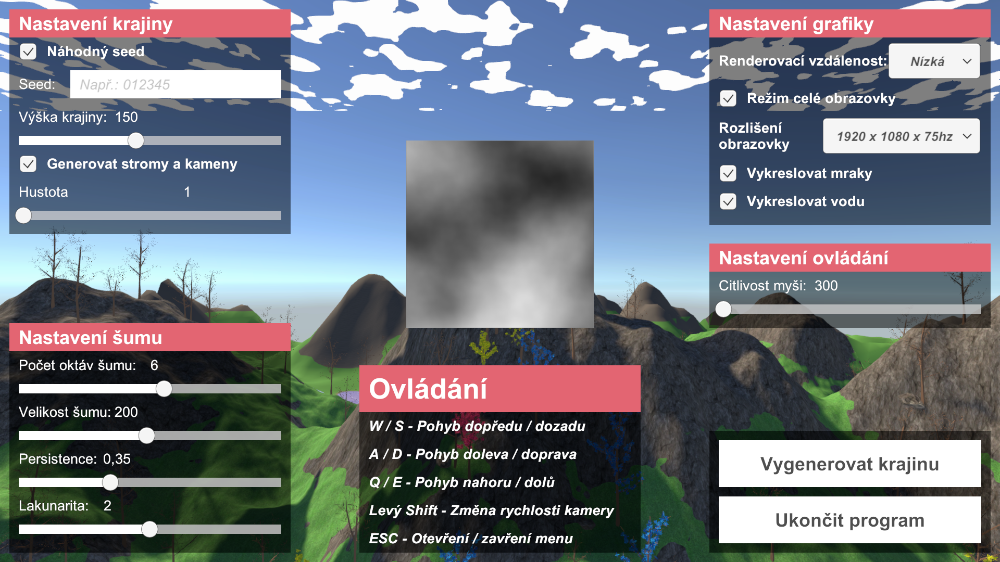
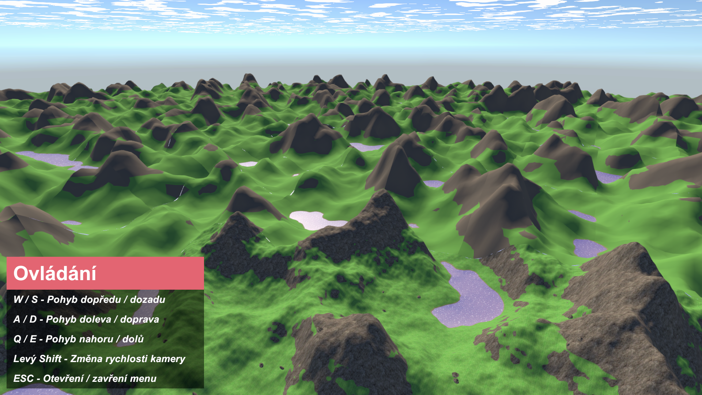

# Unity infinite terrain generation

Infinite terrain generation using Unity
- Simple clouds generation
- Simple water generation
- Terrain object spawner

## How to use ?
1. Download and insert into new Unity URP project
2. Create GameManager project and attach Game_Manager.cs
    - Holds all UI references
    - Collects values from UI and inserts them into TerrainData.cs located in WorldGenerator object
3. Create UI camera, attach under Main camera and create UI (Same elements as shown in the pics below)
    - attach UI references to the Game_Manager.cs
4. Atach CAMERA_Controller.cs to the Main Camera
5. Create World generator project 
    - Attach TerrainData.cs (Holds world data)
    - Attach InfiniteTerrain_GENERATOR.cs
    - Attach World_GENERATOR.cs
6. Run project

### To use without Game Manager object game object
1. Create World generator project 
    - Attach TerrainData.cs (Holds world data)
    - Attach InfiniteTerrain_GENERATOR.cs
    - Attach World_GENERATOR.cs
2. Fill out TerrainData.cs 
3. Open CAMERA_Controller.cs and delete menu calls from Update()

    //DELETE FROM UPDATE()
        if (inMenu){ OpenMenu(); }else{ CloseMenu();  }
        
4. Attach CAMERA_Controller.cs to the Main Camera
5. Run project

